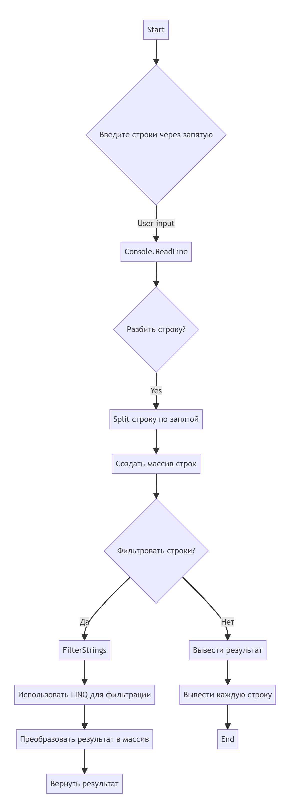

# hw
1. <Блок-схема алгоритма>

2. Обьяснение, как работает код:

Этот код:

Запрашивает строки, разделенные запятой 

Формирует из них массив строк 

Использует LINQ-запрос для фильтрации строк, длина которых меньше или равна 3 символам 

Выводит результат на экран

3. Написала код в C# для решения данной задачи: 

"Написать программу, которая из имеющегося массива строк формирует новый массив из строк, длина которых меньше, либо равна 3 символам. Первоначальный массив можно ввести с клавиатуры, либо задать на старте выполнения алгоритма. При решении не рекомендуется пользоваться коллекциями, лучше обойтись исключительно массивами."

